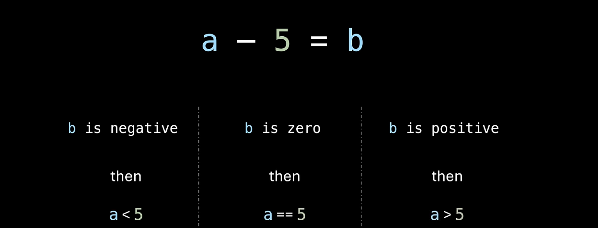

# how are jumps performed?
A jump is performed simply by setting the Address register of the `control unit` to the value of the jump.

# What CPU flags exist?

There exist 3 CPU flags. The ALU sets them whenever it performs a calculation.
- O - Overflow:
	*  The result has overflowed the maximum number size.
- Z - Zero:
	* The result was zero
- N - Negative:
	* the result was less than 0.

Conditional jumps are performed based on the state of the flags.

The statement `a>5` can be checked and verified using these 3 flags. As well as any other boolean statement.

