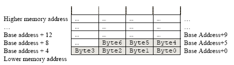

# There are three types of buffering types

- The types can be switched to and fro using the `setvbuf` C standard library function. The types are as follows:
    * unbuffered: 
	+  When an output stream is unbuffered, information appears on the destination file or terminal as soon  as  written.
	+  `stderr` is always unbuffered.
	+  referred to as `_IONBF`.
    - line buffered:
	*  when it is line buffered, characters are saved up until a newline is output  or  input is  read  from  any stream attached to a terminal device (typically stdin).
	*  `referred to as _IOLBF`
    
    - `Default`: block buffered: 
	*  when  it  is  block buffered(default),  many  characters are saved up and written as a block

    -  the function can also take a parameter fully buffered, `referred to as _IOFBF`
- The function `fflush` may be used to force  the  block  out  early.

- They of course each have numerical values:
    * IONBF: 0 (Unbuffered):
	+ Since this one is unbuffered, a null pointer, and a size of 0 are passed as parameters.
    * IOLBF: 1 (Line buffered)
    * IOFBF: 2 (Fully buffered)

- Why use buffers?
 * Buffers reduce the number of read() and write() system calls, improving performance by minimizing the overhead of kernel-user space transitions.

# Write order

Buffers, in general, are written in memory from lower to higher memory. Seeing as the stack grows downwards, if we overflow a buffer at the top of the stack, it will reach higher and higher addresses.

