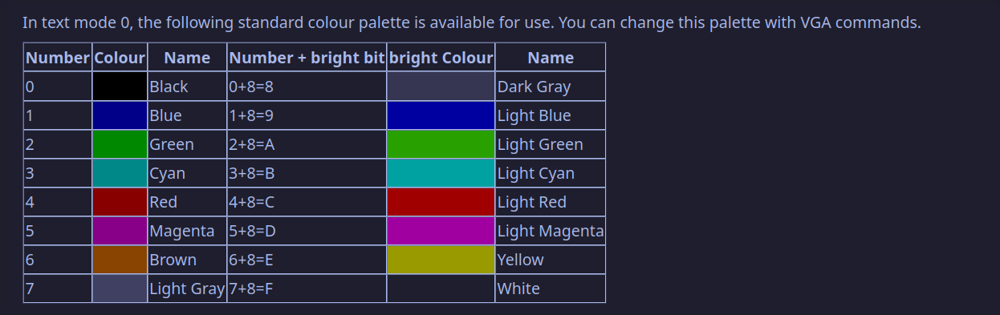

Once we enter 32 bit protected mode, we no longer have access to BIOS interrupts. So what do we do if we want to , say, print a character to the screen? 

# VGA mode 3:

VGA video mode 3, allows direct memory access to a linear address containing each character and its associated attributes.
To access a particular character:
`position = (y_position * characters_per_line) + x_position;`
Each character is represented as an ascii value, and a colour byte.


the color byte is defined as such:

```
Bit 76543210
    ||||||||
    |||||^^^-fore colour
    ||||^----fore colour bright bit
    |^^^-----back colour
    ^--------back colour bright bit OR enables blinking Text
```


